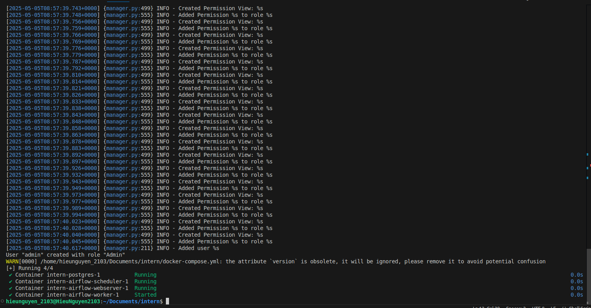
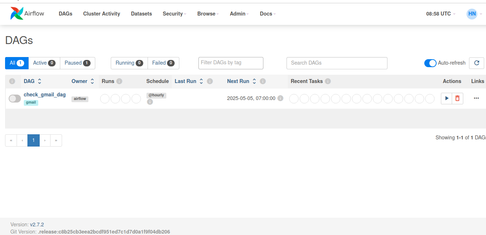
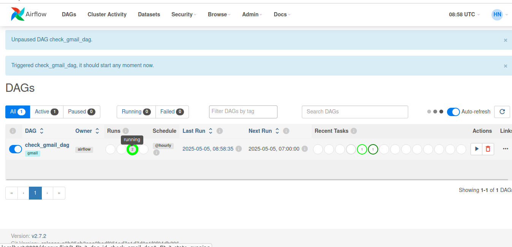
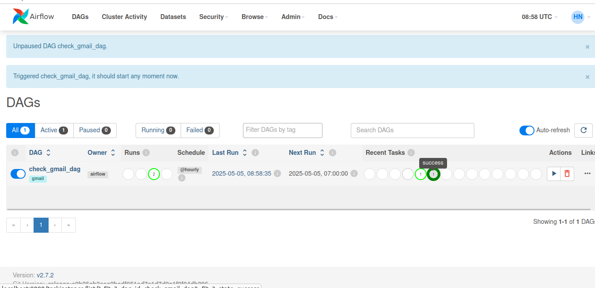
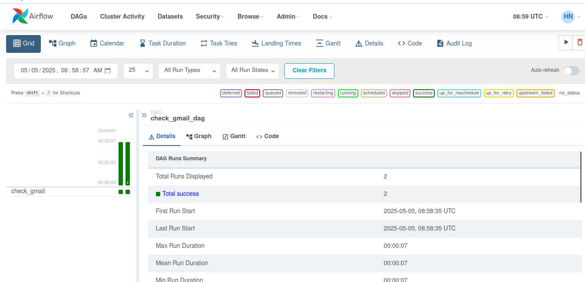
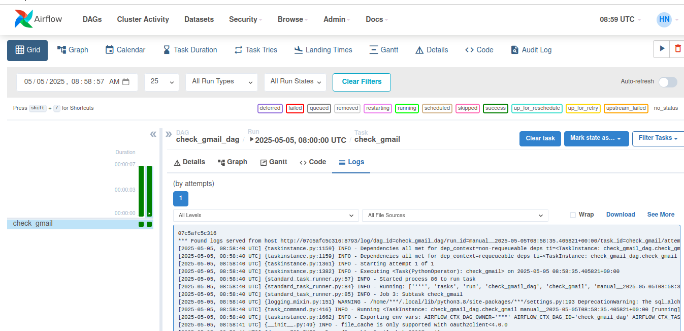

# BÁO CÁO AIRFLOW

## 1. GIỚI THIỆU VỀ AIRFLOW
- Airflow là nền tảng dùng để lập trình tạo ra, lập lịch và giám sát các quy trình công việc.
- Được tạo bởi Airbnb, viết bằng Python.
- Là một hệ thống quản lý workflow, mã nguồn mở.

- Airflow dùng trong:
    - trích xuất, chuyển đổi dữ liệu (Run ETL pipelines).
    - lấy dữ liệu từ các file về 1 kho chung.

## 2. DAG
- Directed Acyclic Graph: Là một đồ thị có hướng, không chu trình, mô tả tất cả các bước xử lý dữ liệu trong một quy trình
- Là công cụ để mô tả workflow.
    VD: Ta cần tính toán (a + b) * (c + d). Ta có task_1 = a + b, task_2 = c + d, task_3 = task_1 * task_2. Như vậy ta sẽ có DAG: [task_1, task_2] >> task_3
- Khi một DAG được thực thi, nó được gọi là một lần chạy DAG
- DAG có thể chạy tự động hoặc thủ công.
- Có thể đặt lịch chạy cho DAG.

- Vòng đời của một trạng thái nhiệm vụ:
    - No status: Tác vụ chưa được xếp hàng để thực hiện.
    - Scheduled: Bộ lập lịch đã xác định rằng các phụ thuộc của nhiệm vụ được đáp ứng và đã lên lịch cho nó chạy.
    - Removed: Tác vụ đã biến mất khỏi DAG kể từ khi bắt đầu chạy.
    - Upstream failed: Tác vụ ngược dòng không thành công. Tức là một tác vụ trước đó trong workflow đã bị lỗi dẫn đến  tác vụ này không thể thực thi được.
    - Queued: Nhiệm vụ đã được giao cho Executor và đang đợi 1 worker có sẵn để thực thi.
    - Running: Tác vụ đang chạy bởi 1 worker.
    - Success: Tác vụ chạy xong không có lỗi
    - Failed: Tác vụ có lỗi trong quá trình thực thi.
    - Up for retry: Tác vụ không chạy thành công nhưng vẫn còn các lần thử lại và sẽ được lên lịch lại.
=> Lý tưởng nhất cho một tác vụ đó chính là đi từ No status -> Scheduled -> Queued -> Running -> Success

## 3. Task 
- Là một đơn vị cơ bản để thực hiện một công việc nhỏ trong quy trình xử lý dữ liệu. Mỗi task sẽ là một bước trong quy trình và có thể được lập lịch thực 
hiện tùy theo điều kiện cụ thể
- Các thuộc tính của task:
    - task_id: Định danh duy nhất của task trong DAG
    - owner: Người sở hữu task
    - depends_on_past: Xác định liệu task hiện tại có phụ thuộc vào kết quả của task trước đó hay không
    - retries: Số lần thử lại nếu task thất bại
    - retry_delay: Khoảng thời gian giữa các lần thử lại
    - start_date: Thời điểm bắt đầu thực hiện task
    - end_date: Thời điểm kết thúc thực hiện task
    - execution_timeout: Thời gian tối đa cho phép thực hiện task
    - on_failure_callback: Hàm được gọi khi task thất bại
    - on_success_callback: Hàm được gọi khi task thành công

## 4. Operator
- Mỗi operator đại diện cho một công việc cụ thể trong quy trình, ví dụ như đọc dữ liệu từ một nguồn, xử lý dữ liệu, ghi dữ liệu vào một nguồn dữ liệu 
khác.
- Các operator trong Airflow được phân thành các loại chính sau:
    - BashOperator: chạy các lệnh Bash hoặc script Shell
    - PythonOperator: Thực thi các hàm Python
    - EmailOperator: Gửi email thông qua SMTP
    - DummyOperator: Được sử dụng để tạo kết nối giữa các task
    - PythonVirtualenvOperator: Thực thi các hàm Python trong một môi trường ảo
    - MySqlOperator: Thực thi các lệnh SQL trên cơ sở dữ liệu MySQL 
    - PostgresOperator: Thực hiện các lệnh SQL trên cơ sở dữ liệu PostgreSQL
    - S3FileTransformOperator: Thực hiện các chức nwang xử lý file treenm Amazon S3
    - SparkSqlOperator: Thực hiện các truy vấn Spark SQL.
    - HdfsSensor: Kiểm tra sự tồn tại của một tệp trên Hadoop Distributed File System (HDFS).

## 5. Sensor 
- Sensor là một loại Operator được sử dụng để giám sát các sự kiện và điều kiện, và thực hiện các hành động tương ứng.
- Sensor thường được sử dụng để đợi cho đến khi một điều kiện nào đó xảy ra trước khi tiếp tục thực hiện quy trình.
- Các loại Sensor trong Airflow bao gồm:
    - FileSensor: Kiểm tra sự tồn tại của một tệp trên hệ thống tệp.
    - TimeSensor: Đợi cho đến khi một khoảng thời gian cụ thể đã trôi qua.
    - HttpSensor: Kiểm tra sự phản hồi của một URL cụ thể.
    - HdfsSensor: Kiểm tra sự tồn tại của một tệp trên Hadoop Distributed File System (HDFS).
    - SqlSensor: Kiểm tra sự tồn tại của một bảng hoặc một số dòng dữ liệu trong cơ sở dữ liệu.
    - S3KeySensor: Kiểm tra sự tồn tại của một đối tượng trên Amazon S3.
    - ExternalTaskSensor: Kiểm tra trạng thái của một task khác trong DAG.

## 6. Xây dựng workflow kiểm tra mail tự động dựa trên Airflow
1. Cài đặt Airflow trên Docker  
Chạy lần lượt các câu lệnh sau:  
```sh 
sudo docker volume prune -f
```  
```sh
sudo docker-compose run --rm airflow-webserver airflow db init
```  

```sh
sudo docker-compose run --rm airflow-webserver airflow users create \
  --username admin \
  --password admin \
  --firstname Hieu \
  --lastname Nguyen \
  --role Admin \
  --email nick_gmail9@gmail.com
```
```sh 
sudo docker-compose up -d
```  

Hoặc chạy file start.sh bằng câu lệnh sau: ```sh sudo ./start.sh```  

Giao diện sau khi chạy thành công Airflow trên Docker:  
  

Ta thấy phần webserver, scheduler có trạng thái là ***running** chứng tỏ Airflow đã chạy thành công.  

Khi webserver đã chạy thành công ta có thể vào giao diện web bằng cách truy cập `localhost:8080`. Tài khoản để đăng nhập chính là **username** và **password** mà ta đã tạo ở bên trên (trong trường hợp này cả **username** và **password** đều là **admin**).  
   

Tại đây ta thấy có 1 DAG là **check_gmail_dag** chính là DAG mà ta đã tạo trong folder **dags/dag.py**. DAG này sẽ được kích hoạt vào ngày 5/5/2025, mỗi giờ chạy 1 lần. Để chạy DAG này thủ công ta sẽ nhấn vào biểu tượng tam giác.  
   
Tại đây sẽ hiển thị trạng thái các task như là Queue, Running, Success.  
   
Tại đây sẽ hiển thị ra số task đã chạy.  
  
Để xem logs của các task, ta chọn task muốn xem rồi chọn Logs như trên hình:  
   
Hoặc ta có thể xem log từ terminal bằng cách sau:  
Tìm id của airflow-scheduler bằng câu lệnh ```sh sudo docker ps```  
Sau đó thực hiện câu lệnh ```sh sudo docker exec -it *id_airflow_scheduler* /bin/bash


